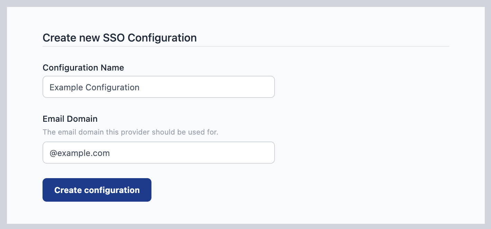
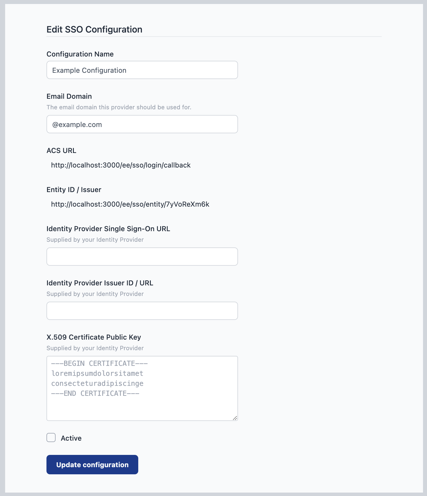

# SAML Single-Sign On

_This feature is only available on EE licensed instances of FlowFuse._

FlowFuse allows users to sign in through their SAML identity provider, such
as Google Workspace.

The platform can be configured with multiple SAML configurations and uses the
user's email domain to identify which identity provider should be used.

The user must already exist on the FlowFuse platform before they can sign in via SSO.

Once enabled for a particular email domain, regular users on that domain will be directed
to the Identity Provider in order to log in. They will no longer be able to log in with
their local password, nor will they be able to change their email address in User Settings.  

Admin users will still be able to log in with their original FlowFuse username/password - this ensures
they don't get locked out of the platform if there is a problem with the Identity
Provider configuration.

## Managing SAML SSO Configurations

The SAML SSO Configurations are managed by the platform Administrator under the
`Admin Settings > Settings > SSO` section.

To fully configure SAML SSO, you will need to generate a configuration in FlowFuse,
provide some of the generated values to your Identity Provider, and copy back some
values they provide.

### Create a SAML SSO Configuration

1. Click 'Create SSO SAML Configuration' to create a new config

   

2. Give the configuration a name to help identify it, and provide the email domain
   name this configuration should apply to.

3. Click 'Create configuration'

   At this point, the configuration has been created and metadata generated for the
   configuration, but it is not active.

   

4. Copy the `ACS URL` and `Entity ID / Issuer` values as you will need to configure
   your Identity Provider with these values.

You can save the configuration at any time by clicking the `Update configuration`
button. The configuration will only be enabled when you tick the `active` checkbox
and save the changes.

### Configure your Identify Provider

Every Identity Provider uses slightly different terminology and varies what
information they require and what they provide. This can make it a tricky task
to complete.

We provide specific guides for the providers we have verified below.

If you have a working configuration for a provider not listed here, please do
share the details so we can add them to the list.

The general points are:

1. Your Identity Provider will supply you with some of the following values that
   should be entered into your FlowFuse SAML SSO Configuration:

    - `Single Sign-On URL` - also referred to as 'SAML Endpoint', 'Login URL' or 'IdP SSO URL'.
    - `Issuer ID / URL`
    - `X.509 Certification Public Key` - the public key of a certificate used to sign
      SAML requests.

2. Configure the `NameID` SAML option to be `EmailAddress` and have it return the email
   of the user logging in. This is how FlowFuse will verify they are a known user
   on the platform.

### Enable your SAML SSO Configuration

Once you have setup both sides of the configuration you can enable it for use
by ticking the `active` checkbox and clicking `Update configuration`.

## Managing Team Membership with SAML Groups

Some SAML providers allow user group information to be shared as part of the sign-in process.
When properly configured, this can be used to manage what FlowFuse teams a user has access to.

To enable this option, select the `Manage roles using group assertions` in the SSO configuration.

The following configuration options should then be set:

 - `Group Assertion Name` - this is used to identify the group membership information in the response
   sent by the Identity Provider. It defaults to `ff-roles` but can be customised if the Identify Provider
   requires it.
 - `Team Scope` - this determines what teams can be managed using this configuration. There are two options:
     - `Apply to all teams` - this will allow the SAML groups to manage all teams on the platform. This is
       suitable for a self-hosted installation of FlowFuse with a single SSO configuration for all users on
       the platform.
     - `Apply to selected teams` - this will restrict what teams can be managed to the provided list. This
       is suitable for shared-tenancy platforms with multiple SSO configurations for different groups of users,
       such as FlowFuse Cloud.
       When this option is selected, an additional option is available - `Allow users to be in other teams`. This
       will allow users who sign-in via this SSO configuration to be members of teams not in the list above.
       Their membership of those teams will not be managed by the SSO groups.
       If that option is disabled, then the user will be removed from any teams not in the list above.

### SAML Groups configuration

A user's team membership is managed by what groups they are in. When the user logs in, the SAML provider
must be configured to provide a list of groups they are a member of as a SAML assertion.

The group name is used to identify a team, using its slug property, and the user's role in the team.
The name must take the form `ff-<team>-<role>`. For example, the group `ff-development-owner` will
container the owners of the team `development`.

The valid roles for a user in a team are:
 - `owner`
 - `member`
 - `viewer`
 - `dashboard`

*Note*: this uses the team slug property to identify the team. This has been chosen to simplify managing
the groups in the SAML Provider - rather than using the team's id. However, a team's slug can be changed
by a team owner. Doing so will break the link between the group and the team membership - so should only
be done with care.

## Providers

The following is a non-exhaustive list of the providers that are known to work
with FlowFuse SAML SSO.

 - [Microsoft Entra](#microsoft-entra)
 - [Google Workspace](#google-workspace)
 - [OneLogin](#onelogin)
 - [Okta](#okta)

### Microsoft Entra

Microsoft provide a guide for creating a custom SAML Application [here](https://learn.microsoft.com/en-us/entra/identity/enterprise-apps/add-application-portal).

The following table maps the Entra terminology to the FlowFuse settings.

FlowFuse Setting | Entra Setting
----|----
`ACS URL` | `Reply URL (Assertion Consumer Service URL)`
`Identity Provider Single Sign-On URL` | `App Federation Metadata Url`
`Identity Provider Issuer ID / URL` | `Entity ID`
`X.509 Certificate Public Key` | `Certificate (Base64)`

Within the `SAML Signing Certificate` configuration, the `Signing Option` must be set to `Sign SAML response and assertion`.

#### Group Membership Configuration

By default, when enabled, Entra will share group assertions under the name `http://schemas.microsoft.com/ws/2008/06/identity/claims/groups` and provides the groups as a list of object ids.

Either the `Group Assertion Name` should be set to this name, or Entra configured to use a custom
assertion name that matches the FlowFuse SSO Configuration value.

Entra must also be configured to return group names rather than object ids.

### Google Workspace

Google provide a guide for creating a custom SAML Application [here](https://support.google.com/a/answer/6087519?hl=en).

Google Workspace only supports HTTPS-based SSO URLs. You cannot use it when developing
locally using `http://localhost:3000`.

The following table maps the Google Workspace terminology to the FlowFuse settings.

FlowFuse Setting | Google Workspace Setting
----|----
`Identity Provider Single Sign-On URL` | `SSO URL`
`Identity Provider Issuer ID / URL` | `Entity ID`
`X.509 Certificate Public Key` | `Certificate`

Within the `Service provider details` configuration, the `Signed response` option must be enabled.

### OneLogin

Follow [this guide](https://onelogin.service-now.com/support?id=kb_article&sys_id=93f95543db109700d5505eea4b96198f) 
to create a `OneLogin SAML Test Connector`.

FlowFuse Setting | OneLogin Setting
----|----
`Identity Provider Single Sign-On URL` | `SAML 2.0 Endpoint (HTTP)`
`Identity Provider Issuer ID / URL` | `Issuer URL`
`X.509 Certificate Public Key` | `X.509 Certificate`

### Okta

Within your Okta Admin dashboard, browse the App Integration catalog and add a new
instance of the `SAML Service Provider` integration.

On the Sign-On Options section, ensure SAML 2.0 is selected. Below that section
you will see a notice saying:

> SAML 2.0 in not configured until you complete the setup instructions.

Click the 'View setup instructions' button to open the page in a new window.

Follow the instructions on that - copying the `Identity Provider Issuer`,
`Identity Provider HTTP POST URL` and `Identity Provider Certificate` values
into the FlowFuse SSO configuration.

Back on the Okta SAML Application configuration page, under the `Advanced Sign-on Settings`
section enter the `Assertion Consumer Service URL` and `Service Provider Entity Id`
from the FlowFuse SSO configuration.

Under `Credential Details` section, change the Application username format to `Email`.

#### Group Membership Configuration

To configure Okta to return Group assertions, edit the Settings of the SAML Service Provider's
SAML 2.0 configuration. Expand the 'Attributes' section and add a `Group Attribute Statement`.

The name must match the `Group Assertion Name` in the FlowFuse SSO configuration (default: `ff-roles`).
You can optionally add a filter of `ff-` so that it only returns groups used by FlowFuse.

