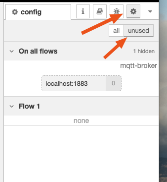
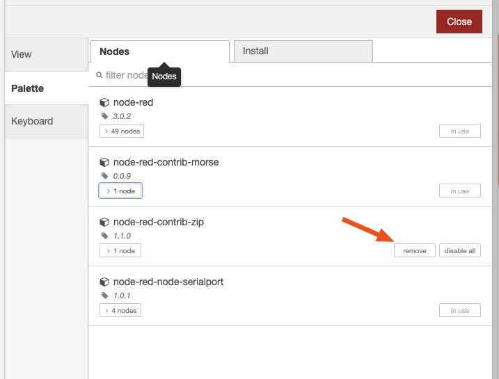
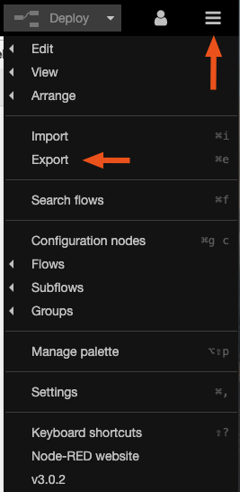

# Migrating a Node-RED project to FlowForge 

This guide will help you to move your project from a generic Node-RED host onto FlowForge Cloud. It has been written with the assumption that you are currently running Node-RED on your own hardware with full access to the terminal and filesystem. If you are running Node-RED on some other cloud or container type service you may need to adjust certain steps.
Before a migration you should ensure you are familiar with how your flow works, there may well be issues specific to your flow or the nodes in use that will require specific debugging outside the scope of this guide.

## Cleanup and Export
Before migrating a project it is a good idea to cleanup any unused nodes or packages, this avoids migrating items that are not required.

### Remove unused config nodes

From your Node-RED editor list the configuration nodes by selecting the cog icon from the right hand side bar and then click on unused.

You will see any config nodes here that are not in use by nodes on your flow. In the example below you can see an MQTT broker.

Ensure that you don’t need these in your flows and then double click on the node and select delete.

### Cleanup unused packages

From the hamburger menu  select Manage palette. Click on the Nodes Tab, this will show all the packages installed on your instance.

Click on the Nodes Tab, this will show all the packages installed on your instance.

You can identify unused packages through the "remove" button instead of "in use". Ensure that you are not using these and then click remove on each one.

Ensure that you are not using these and then click remove on each one.

### Identify installed nodes

Your palette manager should now only include nodes that are required for your flows. You will need to make a note of the name of each package along with the version number.

Presently it is not possible to install older versions of a package into Node-RED so your flows will need to run on the latest version of each package, you may want to consider updating before you migrate.

### Backup your flows

From the Node-RED editor go to the hamburger menu, and select **_Export_**.

In the modal that opens ensure that you  have**_ all flows _**selected and then click the download button. This will download a file called **_flows.json_** to your browser, keep it safe.

### Credentials.

It is not possible to get credential details from the Node-RED editor once they have been entered

There are 2 options available:

Firstly you can walk through your flows manually  and check any credential fields, then make sure you have access to the information in another source.

Follow the instructions at <https://www.hardill.me.uk/wordpress/2021/02/17/viewing-node-red-credentials/> if you have access to the command line for the node-red install.

### Environment Variables

You can use this flow <https://flows.nodered.org/flow/8ebfe9ae218aa5105e7da13db14ac272> to dump a list of your environment variables into the debug window.

### Static Files

Check your settings.js file to see if \`httpStatic\` has been set, if so then check for any files in this path.FlowForge does not currently support serving static files so you will need to find alternative hosting for these such as AWS S3.

## Import to FlowForge

### Create a new FlowForge project 

From your team page click create project and assign a suitable name to the project, 

### Environment Variables.

If your project uses environment variables you can configure these in the FlowForge application under the Project > Settings > Environment tabs.

### Install Nodes

Open the editor and go to the manage palette option in the hamburger menu. 

Now install each of the nodes that you identified in the export earlier.

### Import Flows

From the hamburger menu select "Import". Either paste your `flows.json` or upload the file. Click "Import".
Check that you don’t get any errors about missing nodes. If you do, go back and check that you have installed all the required nodes.

When there are no errors click "Deploy" to save the flows. You may want to ensure your flows are stopped to the "Deploy" action does not start your flows yet.

Either paste your flows.json or upload the file.

Click Import.

Check that you don’t get any errors about missing nodes, if so go back and recheck that you have installed all the required nodes.

If all is good click Deploy to save the flows, you may want to stop the flows first so that they do not start running yet.

### Credentials

Using your list of credentials go through and re-configure any nodes that require credentials, you may need to check the config nodes as well as these will have likely been re-created without their credentials.

**Your project should now be migrated, ensure that the flows are started in the editor and then click Deploy.**
